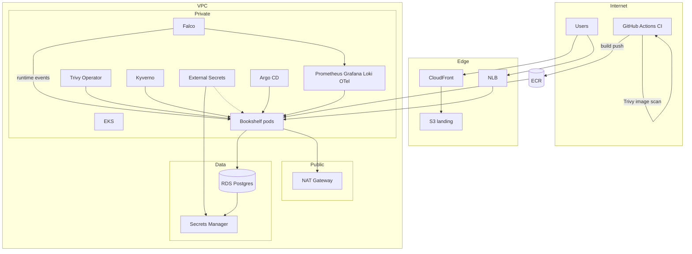

# Bookshelf Platform — Architecture

## Diagram

## Security

| Layer | Tool | Where |
|-------|------|-------|
| Image scan (CI) | Trivy | GitHub Actions — before ECR push |
| Image/config scan (cluster) | Trivy Operator | `trivy-system` |
| Runtime threats | Falco | `falco` namespace |
| Admission policy | Kyverno | `kyverno` |

## Components

| Area | Implementation |
|------|----------------|
| Infra | Terraform/Terragrunt — `terraform/live/{dev,stage,prod}` |
| Apps | Helm chart + Argo CD GitOps |
| Ingress | Istio Gateway + NLB |
| Landing | S3 + CloudFront |
| Secrets | SM → ESO → K8s `bookshelf-db` |
| Governance | Kyverno + Trivy + Falco + NetworkPolicies |
| CI/CD | GHA → Trivy scan → ECR → `image-tags.yaml` → Argo sync |
