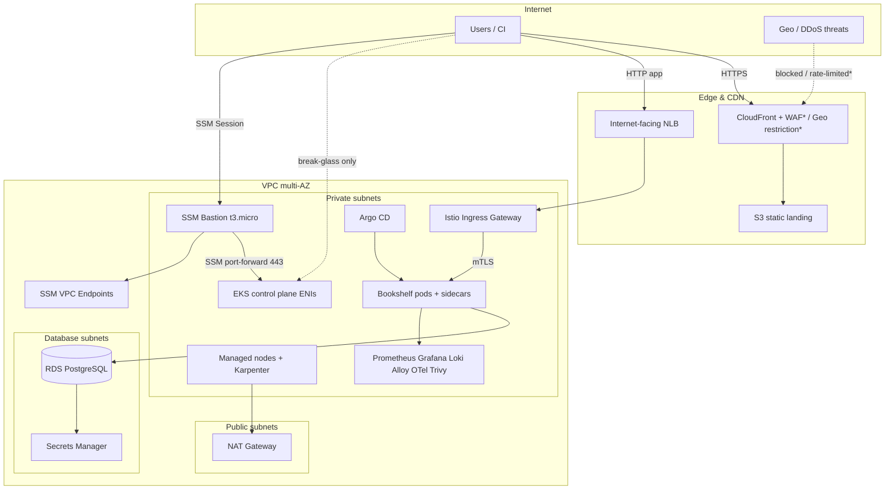

# Bookshelf Platform — Architecture

Assessment: Surge Global DevOps Technical Assessment (cloud-agnostic patterns on **AWS**).

## High-level diagram

\*WAF / multi-region DR shown as design options (diagram bonus); not all are required to be live.

## Component map (assessment checklist)

| Requirement | Implementation |
|-------------|----------------|
| Multi-env Terraform | `terraform/live/{dev,stage,prod}` + Terragrunt `root.hcl` remote state |
| K8s best practices | EKS 1.34, private nodes, IRSA/OIDC, node SG, Karpenter |
| Networking | VPC, public/private/db subnets, NAT, flow logs |
| Secrets | RDS master secret in **Secrets Manager**; no passwords in Git |
| Storage + DB | EBS (CSI), S3; RDS Postgres in isolated subnets |
| Helm deploy | Umbrella chart `k8s/helm/chart/bookshelf` |
| Resilience / HPA / PDB | Deployments, HPA, PDBs, Istio retries/outlier |
| Gateway + LB | Istio Gateway + AWS NLB |
| Static + cache | S3 + CloudFront OAC |
| CI/CD | GitHub Actions → ECR → GitOps tag bump |
| Argo CD (bonus) | GitOps Applications under `k8s/gitops/argocd` |
| Observability (bonus) | Prometheus, Grafana, Loki, Alloy, OTel auto-instr, Kiali |
| Governance (bonus) | Trivy Operator, NetworkPolicies (chart), mesh AuthZ, STRICT mTLS |
| Private API access | Bastion + SSM port-forward (`scripts/eks-port-forward-*.sh`) |

## EKS API access model

1. **Private endpoint**: always on (`endpoint_private_access = true`).
2. **Public endpoint**: **off** in hardened env (`eks_endpoint_public_access = false`).
3. Operators run `scripts/eks-port-forward-dev.sh` → SSM → bastion → API `:443` on `localhost:8443`.
4. kubectl uses `https://localhost:8443` with IAM auth from `aws eks get-token`.

## Security / DR notes (diagram extras)

- CloudFront geo / WAF / Shield for country-level attack reduction.
- Multi-AZ nodes + RDS Multi-AZ (prod) for AZ failure.
- Cross-region S3 replication + secondary CloudFront origin for DR (design only).
- GitOps + immutable ECR tags for rollback.
